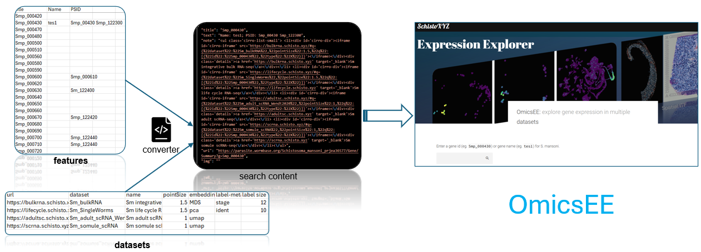
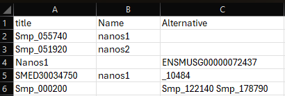
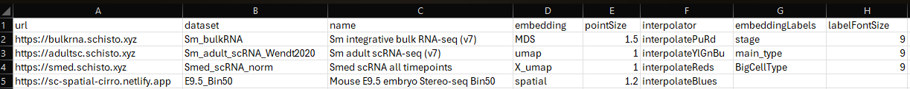
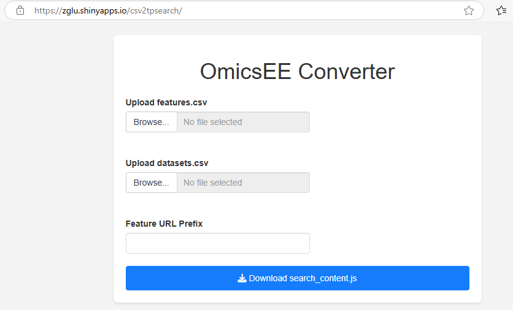
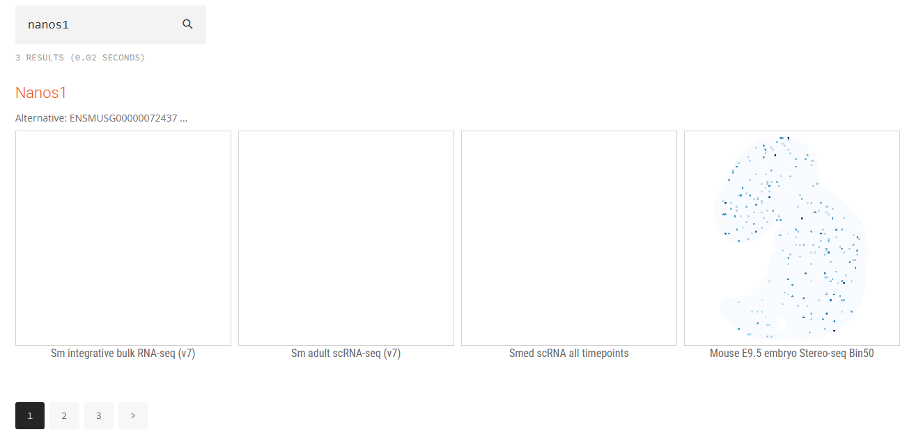
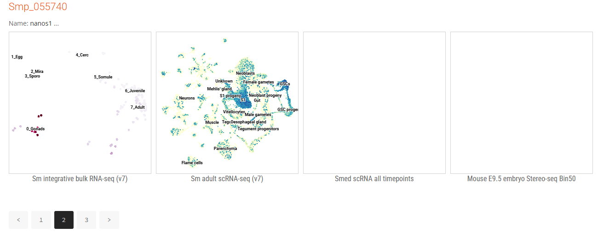

# Omics Expression Explorer (OmicsEE)

This repository contains the simple yet powerful OmicsEE framework for gene expression exploration across multiple datasets and/or modalities (bulk, single-cell, spatial, etc), in any species.

## Overview

The OmicsEE search engine is built on top of the JavaScript-based TipueSearch tool (which is unfortunately deprecated). It allows users to search gene features and link them to interactive visualizations of gene expression data using [Cirrocumulus](https://cirrocumulus.readthedocs.io/en/) instances.

The process involves two main components:

1.  **Features information:** A table containing features to be indexed and searched, such as gene IDs, symbols, ID conversions, and functional annotations.
2.  **Datasets configuration:** A table containing the configuration for each dataset, including Cirro instance URLs and customizable visual parameters.

These two tables are then processed by a Shiny web application to generate a `search_content.js` file, which is used by <code>OmicsEE.html</code> to provide a searchable interface linked to the expression datasets.

## Usage

### 0. Prerequisite
OmicsEE queries data in expression atlases built with Cirrocumulus, which means that there should be Cirro instances (datasets) running, either online or in the local network. See instructions here for Server Mode or as a Static Website: https://cirrocumulus.readthedocs.io/en/latest/installation.html

For *Schistosoma mansoni* and related species, I have prepared a couple of instances ready to use: https://schisto.xyz/atlases

### 1. Prepare your `features.csv`
A CSV file containing gene features with up to 3 columns.

* The first column must be named "title" and contain eg. gene ID or symbols **present in the datasets**
* Additional two columns can contain other features (symbols, annotations, etc.), **searchable**
 
 Here is an example (`demo_features.csv`):

### 2. Prepare your `datasets.csv`
A CSV file containing atlas dataset configurations with up to 8 columns. 

* Required columns:
    * `url`: Cirro instance URL, eg. https://bulkrna.schisto.xyz
    * `dataset`: Dataset name (the 2nd line after clicking 🛈 in a Cirro instance).
* Optional columns:
    * `name`: Display name for the dataset.
    * `embeddings`: Embedding name, eg. pca, umap, spatial.
    * `pointSize`: Point size in ratio, default "1".
    * `interpolator`: Color scheme, default "interpolateYlGnBu".
    * `embeddingLabels`: Embedding labels to show.
    * `labelFontSize`: Label font size in px.
    
Here is an example (`demo_datasets.csv`):

### 3. Convert the csv files to searchable content
To faciliate the conversion process, I've built a simple Shiny App: https://zglu.shinyapps.io/csv2tpsearch/

You can upload your `genes.csv` and `datasets.csv` files accordingly in the web app, and optionally provide the feature URL prefix (eg. link to an external database). Then click the "Download search_content.js" button to download the file (`search_content.js`).

> Please note that for a large number of genes and datasets, it could take some time to convert.

> I highly recommend limiting the number of datasets to 8

### 4. Explore
Put the `OmicsEE.html` and the `search_content.js` in the same directory. Open the html file in your web browser, and start exploring! (You can type in any column value in the genes.csv)

You can click the title to check gene information in external databases, and open individual dataset with the gene queried (link below each frame). Unavailable search will indicate an empty frame. 

## Examples
- https://schisto.xyz/explore/ (for *Schistosoma mansoni*)
- https://schisto.xyz/explore-smed/ (for *Schmidtea mediterranea*)

## License
This project is licensed under the [MIT License](LICENSE).
